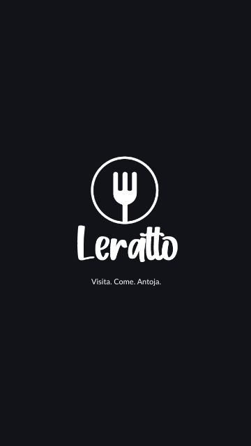
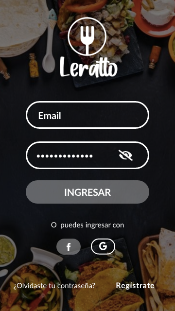
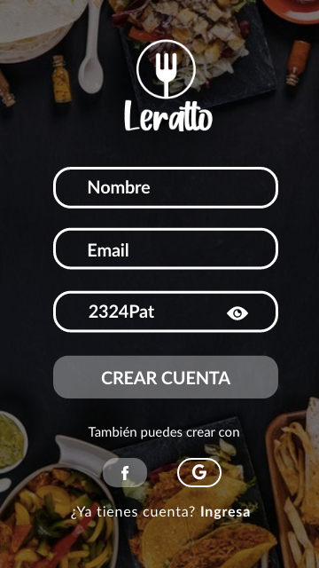
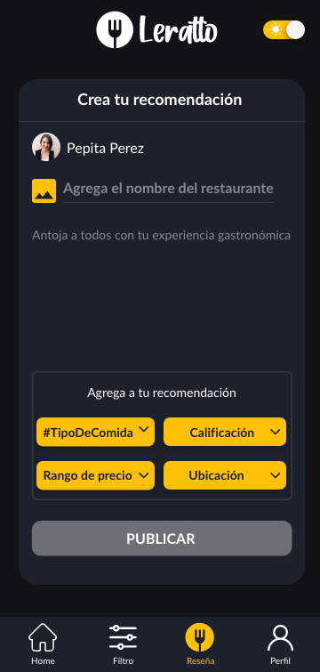
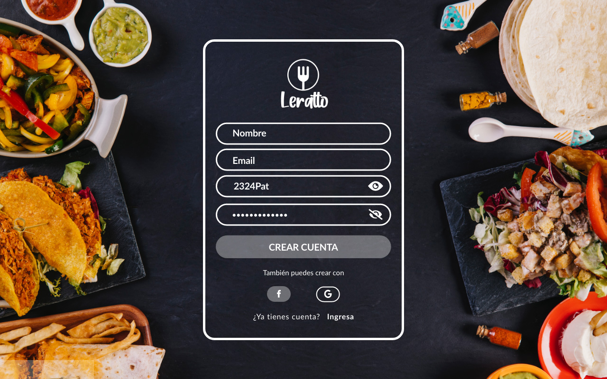

  

# Leratto

## Índice

* [1. Definición del producto](#1-definición-del-producto)
* [2. Historia de usuarios](#2-historia-de-usuarios)
* [3. Prototipos](#3-prototipos)
* [4. Feedback](#4-feedback)
* [5. Objetivos de aprendizaje](#5-objetivos-de-aprendizaje)

## 1. Definición del producto
Red social para amantes de la comida. En Leratto podrás compartir y encontrar recomendaciones gastronómicas de la ciudad. Publica la mejor foto de tu plato, calificar por calidad y precio. 

## 2. Historia de usuarios
- H1: Yo como usuario amante de la comida quiero registrarme en una red social para ser miembro de Leratto.
- H2: Yo como usuario amante de la comida quiero loguearme en la red social para compartir y encontrar recomendaciones gastronómicas.
- H3: Yo como usuario amante de la comida quiero crear posts por medio de texto e imagen para compartir mis experiencias gastronómicas.
- H4: Yo como usuario amante de la comida quiero visualizar posts de otros usuarios para conocer recomendaciones.
- H5: Yo como usuario amante de la comida quiero editar y borrar posts por medio de texto e imagen para compartir mis experiencias gastronómicas.
- H6: Yo como usuario amante de la comida quiero dar like a posts para reaccionar a otras publicaciones.

## 3. Prototipos

#### Paleta de colores

  

En nuestra paleta de colores, existe un contraste de colores calidos con colores frios. Nuestros colores representan la tendencia de las aplicaciones en modo oscuro, porque deseamos que nuestros usuarios reduzcan la fatiga visual provocada por la prolongada exposición al brillo de las pantallas además ayuda a tener un aspecto más agradable. El color amarillo genera más apetito en las personas.

#### Protipo de baja

#### Protipo de alta

##### Mobile

     

##### Web

    

## 4. Feedback
En nuestro proyecto recibimos feedback de nuestras compañeras, equipo de <L> y diferentes usuarios potenciales de nuestra app. En los diferentes comentarios nos recomendaron aumentar el tamaño de la tipografía, botones y diagramación de textos en las tarjetas de post.

## 5. Objetivos de aprendizaje

### HTML y CSS

* [x] [Uso de HTML semántico.](https://developer.mozilla.org/en-US/docs/Glossary/Semantics#Semantics_in_HTML)
* [x] Uso de selectores de CSS.
* [x] Construir tu aplicación respetando el diseño realizado (maquetación).
* [x] [Uso de flexbox en CSS.](https://css-tricks.com/snippets/css/a-guide-to-flexbox/)

### DOM y Web APIs

* [x] Uso de selectores del DOM.
* [x] Manejo de eventos del DOM.
* [x] [Manipulación dinámica del DOM.](https://developer.mozilla.org/es/docs/Referencia_DOM_de_Gecko/Introducci%C3%B3n)
(appendChild |createElement | createTextNode| innerHTML | textContent | etc.)
* [ ] [History API.](https://developer.mozilla.org/es/docs/DOM/Manipulando_el_historial_del_navegador)
* [x] [localStorage.](https://developer.mozilla.org/es/docs/Web/API/Window/localStorage)

### JavaScript

* [x] Uso de condicionales (if-else | switch | operador ternario)
* [x] Uso de funciones (parámetros | argumentos | valor de retorno)
* [ ] Manipular arrays (filter | map | sort | reduce)
* [x] Manipular objects (key | value)
* [x] Uso ES modules ([`import`](https://developer.mozilla.org/en-US/docs/Web/JavaScript/Reference/Statements/import)
| [`export`](https://developer.mozilla.org/en-US/docs/Web/JavaScript/Reference/Statements/export))
* [ ] Diferenciar entre expression y statements.
* [ ] Diferenciar entre tipos de datos primitivos y no primitivos.
* [x] [Uso de callbacks.](https://developer.mozilla.org/es/docs/Glossary/Callback_function)
* [x] [Consumo de Promesas.](https://scotch.io/tutorials/javascript-promises-for-dummies#toc-consuming-promises)

### Testing

* [ ] [Testeo unitario.](https://jestjs.io/docs/es-ES/getting-started)
* [ ] [Testeo asíncrono.](https://jestjs.io/docs/es-ES/asynchronous)
* [x] [Uso de librerias de Mock.](https://jestjs.io/docs/es-ES/manual-mocks)

### Estructura del código y guía de estilo

* [x] Organizar y dividir el código en módulos (Modularización)
* [x] Uso de identificadores descriptivos (Nomenclatura | Semántica)
* [x] Uso de linter (ESLINT)

### Git y Github

* [x] Uso de comandos de git (add | commit | pull | status | push)
* [x] Manejo de repositorios de GitHub (clone | fork | gh-pages)
* [x] Colaboración en Github (branches | pull requests)
* [ ] Colaboración en Github (tags)
* [x] Organización en Github (projects | issues | labels | milestones)

### Firebase

* [x] [Firestore.](https://firebase.google.com/docs/firestore)
* [x] [Firebase Auth.](https://firebase.google.com/docs/auth/web/start)
* [ ] [Firebase security rules.](https://firebase.google.com/docs/rules)
* [ ] Observadores. ([onAuthStateChanged](https://firebase.google.com/docs/auth/web/manage-users?hl=es#get_the_currently_signed-in_user))
* [x] Observadores. ([onSnapshot](https://firebase.google.com/docs/firestore/query-data/listen#listen_to_multiple_documents_in_a_collection))

### UX

* [x] Diseñar la aplicación pensando y entendiendo al usuario.
* [x] Crear prototipos para obtener feedback e iterar.
* [x] Aplicar los principios de diseño visual (contraste, alineación, jerarquía)
* [x] Planear y ejecutar tests de usabilidad.
